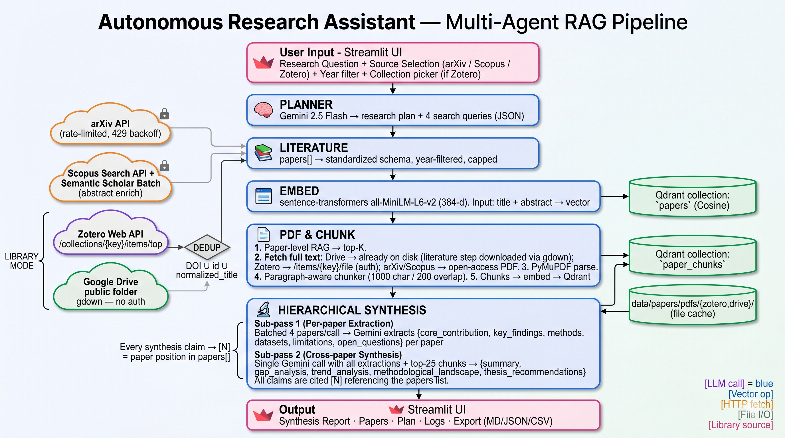

# 🔬 Autonomous Research Assistant (ARA)

**Multi-agent literatür tarama, RAG tabanlı embedding ve grounded (kaynağa dayalı) sentez sistemi.**

Bir araştırma sorusu girersiniz; sistem otomatik olarak bir araştırma planı çıkarır, akademik kaynakları (arXiv / Scopus / Zotero / Google Drive) tarar, makaleleri bir vektör veritabanına işler, PDF'lerin tam metnini çıkarıp parçalara böler ve sonunda **yalnızca bulduğu kaynaklara dayanan**, atıflı bir sentez raporu üretir.

> Bu proje, **Karadeniz Teknik Üniversitesi – Yazılım Mühendisliği Ana Bilim Dalı**, *Yapay Zeka için Bulut Bilişim* dersi kapsamında **Enes Buğra Gürbüz (458222)** tarafından hazırlanmıştır.

---

## 📑 İçindekiler

1. [Sistem Nasıl Çalışır? (Özet)](#-sistem-nasıl-çalışır-özet)
2. [Teknoloji Yığını](#-teknoloji-yığını)
3. [Kurulum ve Başlatma Yardımcısı (İlk Kez Kullananlar İçin)](#-kurulum-ve-başlatma-yardımcısı-i̇lk-kez-kullananlar-i̇çin)
4. [Uygulamayı Kullanma](#-uygulamayı-kullanma)
5. [Arama Modları](#-arama-modları)
6. [API Anahtarları](#-api-anahtarları)
7. [Proje Yapısı](#-proje-yapısı)
8. [Sık Karşılaşılan Sorunlar](#-sık-karşılaşılan-sorunlar)

---

## 🧭 Sistem Nasıl Çalışır? (Özet)

Sistem, **LangGraph** ile kurulmuş 5 ajanlı bir boru hattıdır (pipeline). Ajanlar paylaşılan bir durum (state) üzerinden sırayla çalışır:




| Ajan | Görevi |
|------|--------|
| 🧠 **Planner** | Sorguyu analiz eder; araştırma stratejisi ve birbirini tamamlayan 4 İngilizce arama sorgusu üretir. |
| 📚 **Literature** | Seçilen kaynaklardan makaleleri toplar, tekilleştirir (dedup), yıl ve sayı filtresi uygular. |
| 🗄️ **Embed** | Her makalenin başlık+özetini bir vektöre çevirip yerel Qdrant veritabanına yazar (paper-level RAG). |
| 📄 **PDF & Chunk** | En alakalı makalelerin PDF'lerini indirir, metni çıkarır, ~1000 karakterlik parçalara böler ve ayrı bir koleksiyona indeksler (chunk-level RAG). |
| 🔬 **Synthesis** | İki geçişli (multi-pass) sentez yapar: önce her makaleden yapılandırılmış bilgi çıkarır, sonra makaleler arası karşılaştırmalı, **atıflı** bir rapor üretir. |

Detaylı teknik açıklama için projedeki **`docs/`** klasöründeki rapora bakınız.

---

## 🧰 Teknoloji Yığını

| Katman | Teknoloji | Not |
|--------|-----------|-----|
| Orkestrasyon | **LangGraph** | Ajanlar arası durum makinesi |
| LLM | **Google Gemini 2.5 Flash** | Bulut API (anahtar gerekir) |
| Embedding | **sentence-transformers / all-MiniLM-L6-v2** | Yerel, 384 boyut, API'siz |
| Vektör DB | **Qdrant** | Yerel disk modu, sunucu gerekmez |
| Arayüz | **Streamlit** | Web tabanlı UI |
| PDF | **PyMuPDF** | Tam metin çıkarımı |
| Kaynaklar | arXiv API, Scopus (Elsevier), Zotero Web API, Google Drive (gdown) | |

---

## 🚀 Kurulum ve Başlatma Yardımcısı

Aşağıdaki adımları sırayla takip edin. Tahmini süre: **5–10 dakika** (model indirme dahil).

### Adım 0 — Gereksinimler

- **Python 3.10 – 3.12** önerilir (3.13/3.14 de çalışır ancak bazı bağımlılıklar için 3.10–3.12 en güvenlidir).
- Yaklaşık **500 MB** boş disk (bağımlılıklar + embedding modeli + indirilen PDF'ler).
- Bir **Gemini API anahtarı** (ücretsiz alınabilir — bkz. [API Anahtarları](#-api-anahtarları)).

Python sürümünüzü kontrol edin:

```bash
python3 --version
```

### Adım 1 — Projeyi açın

`.zip` dosyasını açtıysanız klasöre girin:

```bash
cd oto-research-multi-agent-ev-charging-main
```

### Adım 2 — Sanal ortam oluşturun (önerilir)

**macOS / Linux:**
```bash
python3 -m venv .venv
source .venv/bin/activate
```

**Windows (PowerShell):**
```powershell
python -m venv .venv
.venv\Scripts\Activate.ps1
```

### Adım 3 — Bağımlılıkları kurun

```bash
pip install --upgrade pip
pip install -r requirements.txt
```

> İlk kurulumda `torch` ve `sentence-transformers` indirileceği için bu adım birkaç dakika sürebilir.

### Adım 4 — Embedding modelini indirin (tek seferlik)

Embedding ağırlıkları (~87 MB) repoya dahil **değildir**. Bir kez indirin:

```bash
python download_model.py
```

Bu komut modeli `models/all-MiniLM-L6-v2/` klasörüne kaydeder. Sonraki çalıştırmalarda model yerelden yüklenir, internete çıkmaz. (Bu adımı atlarsanız uygulama ilk çalıştırmada modeli otomatik olarak Hugging Face Hub'dan indirmeye çalışır.)

### Adım 5 — Uygulamayı başlatın

```bash
streamlit run ui/app.py
```

Tarayıcınızda otomatik olarak `http://localhost:8501` açılır.

### Adım 6 — Gemini API anahtarını girin

İlk açılışta, zorunlu anahtar eksikse otomatik bir **🔑 API Anahtarları** penceresi açılır. Gemini anahtarınızı yapıştırıp **Kaydet**'e basın. Anahtar, proje kökündeki `.env` dosyasına yazılır; tekrar girmeniz gerekmez.

✅ **Hazırsınız!** Artık araştırma sorunuzu girip *Araştırmayı Başlat* diyebilirsiniz.

---

## 🖱️ Uygulamayı Kullanma

1. **Kaynak modunu seçin** (sol panel): 🌐 Web Arama veya 📂 Kütüphane.
2. **Kaynakları işaretleyin** (arXiv / Scopus, ya da Zotero / Drive).
3. **Filtreleri ayarlayın**: maksimum makale sayısı, yıl aralığı, sıralama.
4. Üstteki kutuya **araştırma sorunuzu** olabildiğince açık şekilde yazın.
   *Örn: "retrieval augmented generation methods for reducing hallucination in LLM agents"*
5. **🔍 Araştırmayı Başlat**'a tıklayın.
6. Pipeline çalışırken **canlı logları** ve **adım durumunu** izleyin.
7. Bitince sekmelerden sonuçları inceleyin:
   - **🔬 Sentez Raporu** — atıflı genel değerlendirme, gap analizi, trend analizi, tez önerileri.
   - **📄 Makaleler** — bulunan makaleler (kart/tablo). Baştaki numara, sentezdeki `[N]` atıflarıyla eşleşir.
   - **📋 Plan** — üretilen arama sorguları ve adım süreleri.
   - **🧾 Loglar** — tüm pipeline logları.
   - **⬇️ Export** — raporu **Markdown / JSON / CSV** olarak indirin.

---

## 🔀 Arama Modları

Sistem birbirini dışlayan iki üst moda sahiptir:

### 🌐 Web Arama Modu
Açık akademik kaynaklarda, Planner'ın ürettiği sorgularla tarama yapar.
- **arXiv** — anahtar gerektirmez, açık erişim PDF'ler indirilebilir.
- **Scopus** — `SCOPUS_API_KEY` gerektirir. Abstract'lar Semantic Scholar ile zenginleştirilir.

### 📂 Kütüphane Modu
Kendi koleksiyonunuz üzerinde çalışır (Planner sorguları kullanılmaz; tüm koleksiyon alınır).
- **Zotero** — `ZOTERO_API_KEY` + `ZOTERO_USER_ID` gerektirir; koleksiyon seçilir, PDF ekleri kullanılır.
- **Google Drive** — "Bağlantıya sahip herkes" olarak paylaşılmış bir **klasör** linki verilir; içindeki tüm PDF'ler indirilip işlenir (auth gerekmez).

> **Temel fark:** Web modu *internetteki güncel literatürü keşfeder*; Kütüphane modu ise *sizin elinizdeki belgeleri analiz eder*. Çoklu kaynak seçildiğinde sonuçlar otomatik tekilleştirilir ve makale kotası kaynaklar arasında dengelenir.

---

## 🔑 API Anahtarları

Anahtarlar uygulama içindeki **🔑 API Anahtarları** penceresinden girilir ve proje kökündeki `.env` dosyasına yazılır.

| Anahtar | Zorunlu mu? | Nereden alınır |
|---------|-------------|----------------|
| `GEMINI_API_KEY` | ✅ **Evet** | [Google AI Studio → Get API key](https://aistudio.google.com/app/apikey) |
| `SCOPUS_API_KEY` | Sadece Scopus için | [Elsevier Developer Portal](https://dev.elsevier.com/apikey/manage) |
| `ZOTERO_API_KEY` | Sadece Zotero için | [zotero.org/settings/keys](https://www.zotero.org/settings/keys) |
| `ZOTERO_USER_ID` | Sadece Zotero için | Aynı sayfada "Your userID for use in API calls is: …" |

`.env` dosyasını elle de düzenleyebilirsiniz:

```env
GEMINI_API_KEY=AIza...
SCOPUS_API_KEY=
ZOTERO_API_KEY=
ZOTERO_USER_ID=
```

---

## 📁 Proje Yapısı

```
oto-research-multi-agent-ev-charging-main/
├── ui/
│   └── app.py                 # Streamlit arayüzü (giriş noktası)
├── src/
│   ├── graph/
│   │   ├── research_graph.py  # LangGraph pipeline tanımı
│   │   └── state.py           # Paylaşılan durum (ResearchState)
│   ├── agents/
│   │   ├── planner.py         # 🧠 Planner ajanı
│   │   ├── literature.py      # 📚 Literature ajanı
│   │   ├── embed.py           # 🗄️ Embed ajanı
│   │   ├── pdf_fetcher.py     # 📄 PDF & Chunk ajanı
│   │   ├── synthesis.py       # 🔬 Synthesis ajanı (multi-pass)
│   │   └── llm.py             # Gemini LLM yardımcısı
│   ├── rag/
│   │   ├── embedder.py        # sentence-transformers embedding
│   │   ├── chunker.py         # Paragraf-aware chunk'lama
│   │   └── vector_store.py    # Qdrant (papers + paper_chunks)
│   ├── tools/                 # arxiv / scopus / zotero / gdrive araçları
│   └── config/
│       └── api_keys.py        # .env okuma/yazma + maskeleme
├── tools/                     # PDF indirici & parser
├── docs/                      # 📄 Proje raporu (.docx)
├── download_model.py          # Embedding modelini indirme betiği
├── requirements.txt
└── .env                       # API anahtarları (gizli)
```

**Üretilen veriler** (`.gitignore`'da):
- `models/` — embedding modeli ağırlıkları
- `data/qdrant/` — yerel vektör veritabanı
- `data/papers/pdfs/` — indirilen PDF'ler

---

## 🛠️ Sık Karşılaşılan Sorunlar

| Sorun | Çözüm |
|-------|-------|
| `GEMINI_API_KEY ortam değişkeni ayarlanmamış!` | 🔑 penceresinden Gemini anahtarını girin. |
| Embedding modeli her açılışta indiriliyor | `python download_model.py` komutunu çalıştırın. |
| arXiv `429` (rate limit) | Sistem otomatik bekler (exponential backoff). Maksimum makale sayısını düşürün. |
| Scopus/Zotero "anahtar eksik" uyarısı | İlgili anahtarları `.env`'e ekleyin; o kaynağı kullanmayacaksanız işaretlemeyin. |
| Yayıncı sitelerinden PDF inmiyor (IEEE, Springer, Elsevier…) | Bu domain'ler kapalı erişim olduğu için bilerek atlanır; makale yine abstract ile sentezde kullanılır. |
| Streamlit dosya izleme hatası | `.streamlit/config.toml` içinde `fileWatcherType = "none"` ayarlıdır. |

---

*Akademik kullanım içindir. Sentezdeki tüm bulgular yalnızca sistemin bulduğu kaynaklara dayanır; nihai akademik çalışma için orijinal makaleler kontrol edilmelidir.*
